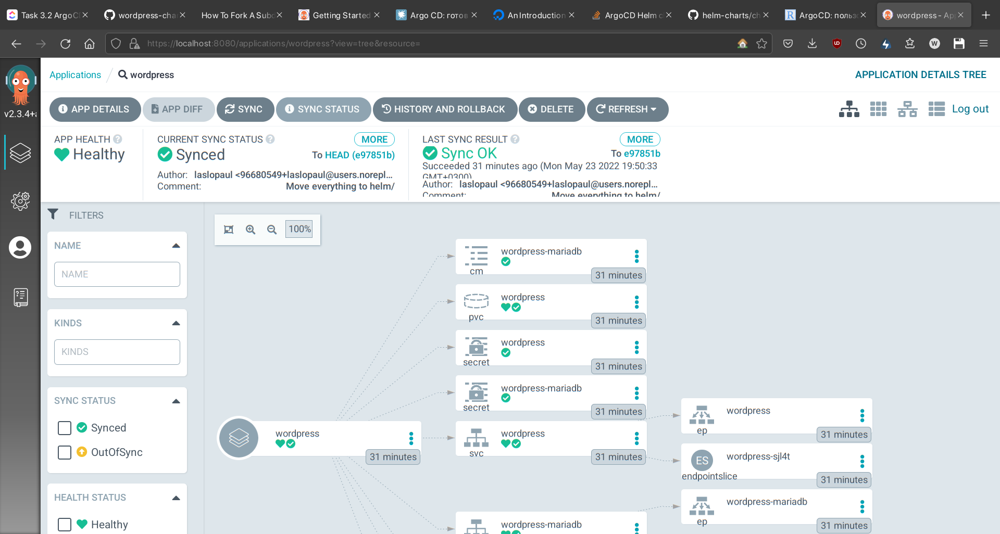
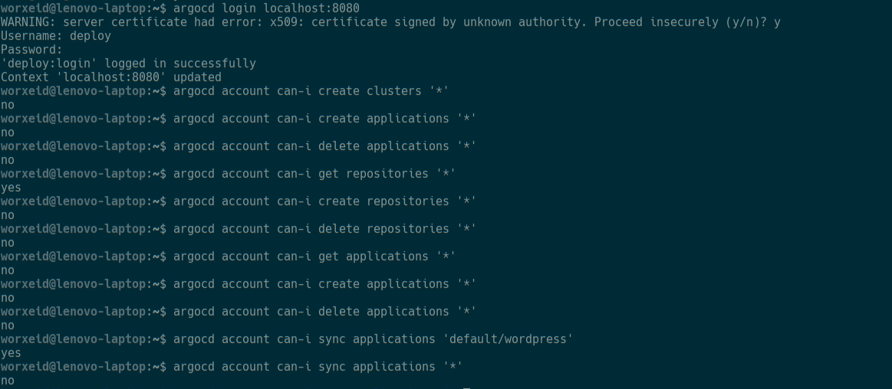
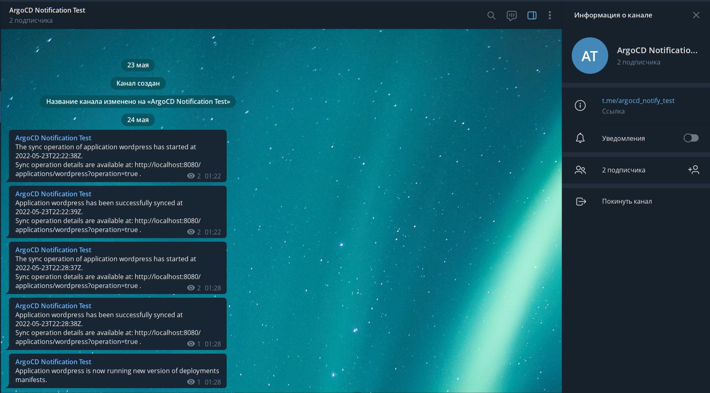
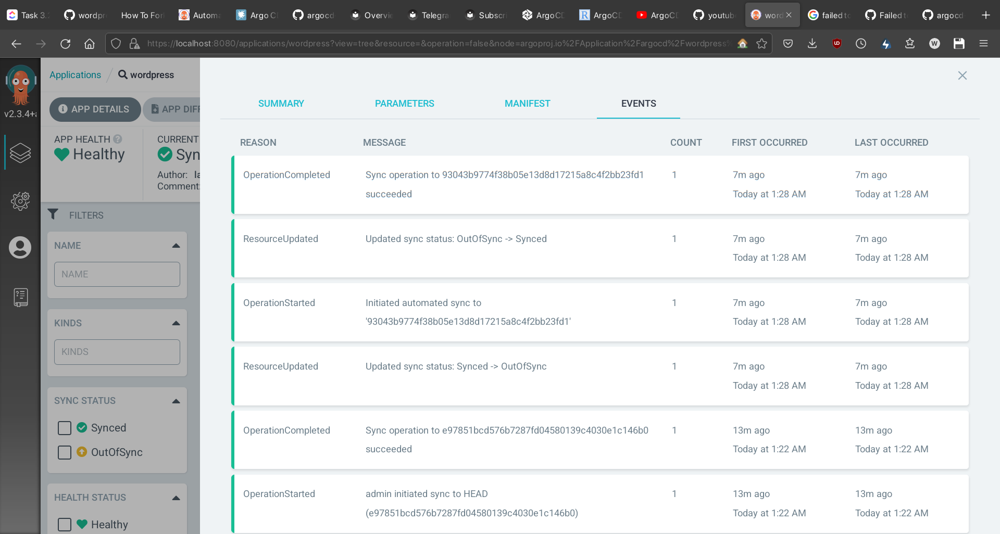

# Установка ArgoCD

1. Устанавливаем приложение и пробрасываем порт 8080 для открытия доступа
    ```bash
    kubectl create namespace argocd
    kubectl apply -n argocd -f https://raw.githubusercontent.com/argoproj/argo-cd/stable/manifests/install.yaml
    kubectl port-forward svc/argocd-server -n argocd 8080:443
    ```
        
2. Устанавливаем CLI-клиент и логинимся через него
    ```bash
    curl -sSL -o /usr/local/bin/argocd https://github.com/argoproj/argo-cd/releases/latest/download/argocd-linux-amd64
    chmod +x /usr/local/bin/argocd
    argocd login localhost:8080 --insecure
    ```
        
3. Запускаем туннель, чтобы потом иметь доступ к нашему вордпрессу
    ```bash
    minikube tunnel
    ```


# Добавление приложения Wordpress и настройка автосинхронизации

```bash
argocd app create wordpress --repo https://github.com/laslopaul/wordpress-chart.git --path helm --dest-server https://kubernetes.default.svc --dest-namespace default

argocd app sync wordpress

argocd app set wordpress --sync-policy automated
```

Проверяем:



# Добавление пользователя deploy и настройка прав доступа
1. Применяем манфесты и устанавливаем пароль для нового пользователя
    ```bash
    kubectl apply -f 00-new-user.yaml
    argocd account update-password --account deploy
    kubectl apply -f 01-user-permissions.yaml
    ```

2. Проверяем права доступа пользователя deploy


# Уведомления в Telegram
1. Устанавливаем ArgoCD Notifications
    ```bash
    kubectl apply -n argocd -f https://raw.githubusercontent.com/argoproj-labs/argocd-notifications/v1.2.1/manifests/install.yaml

    kubectl apply -n argocd -f https://raw.githubusercontent.com/argoproj-labs/argocd-notifications/v1.2.1/catalog/install.yaml

    ```

2. Создаем новый канал и бота в Telegram, назначаем бота админом в этом канале.

3. Прописываем токен нашего бота в файле 02-secret.yaml, применяем настройки.

4. Добавляем ссылку на токен бота в конфигмап argocd-notifications-cm
    ```bash
    kubectl apply -f 03-notification-config.yaml
    ```
5. Прописываем юзернейм телеграм-канала в файле 04-wordpress.yaml, применяяем настройки.

6. Пушим коммит в наш форкнутый реопзиторий с вордпрессом, проверяем результат


